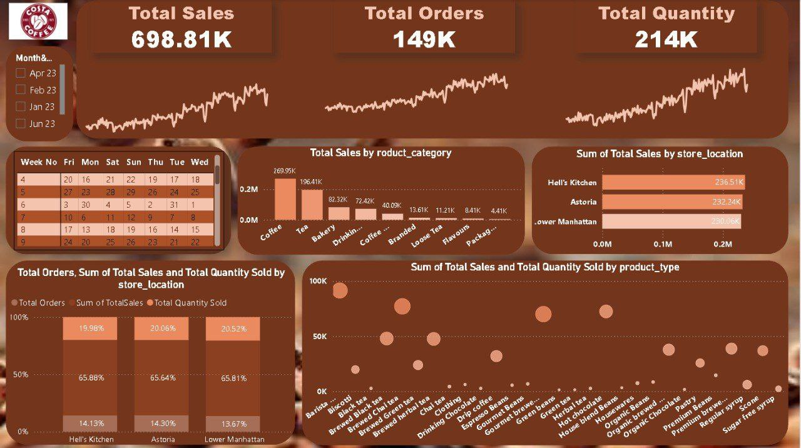

# Costa-Coffee

## Overview
Costa-Coffee is a project aimed at analyzing sales data for Costa Coffee. The project includes data analysis and visualization to help understand sales trends and performance.

## Files
- `CostaSales New419.xlsx`: Contains the sales data for Costa Coffee, including information on sales transactions, product details, and customer demographics.
  - **Columns:**
    - `TransactionID`: Unique identifier for each sales transaction.
    - `Date`: Date of the transaction.
    - `ProductID`: Unique identifier for each product.
    - `ProductName`: Name of the product sold.
    - `Category`: Category to which the product belongs.
    - `Quantity`: Number of units sold in the transaction.
    - `Price`: Price per unit of the product.
    - `TotalAmount`: Total amount for the transaction (Quantity * Price).
    - `CustomerID`: Unique identifier for each customer.
    - `CustomerName`: Name of the customer.
    - `CustomerAge`: Age of the customer.
    - `CustomerGender`: Gender of the customer.
    - `StoreID`: Unique identifier for each store.
    - `StoreLocation`: Location of the store where the transaction took place.

- `project three.pbix`: Power BI file for visualizing the sales data.
- `README.md`: This file, providing an overview of the project.

## Getting Started
1. Open `CostaSales New419.xlsx` to view the raw sales data.
2. Use `project three.pbix` with Power BI to explore the visualizations and insights derived from the sales data.

## Screenshots

### Power BI Dashboard


## Charts Description
- **Sales Over Time**: A line chart showing the trend of sales over different time periods.
- **Top Selling Products**: A bar chart displaying the top-selling products based on total sales.
- **Sales by Category**: A pie chart illustrating the distribution of sales across different product categories.
- **Customer Demographics**: A set of charts showing the age and gender distribution of customers.
- **Store Performance**: A bar chart comparing the performance of different stores based on total sales.

## Requirements
- Microsoft Excel to view the `.xlsx` file.
- Microsoft Power BI to open and interact with the `.pbix` file.

## How to Install
1. **Clone the repository:**
   ```sh
   git clone https://github.com/Kero-fady/Costa-Coffee.git

## License
This project is licensed under the MIT License.